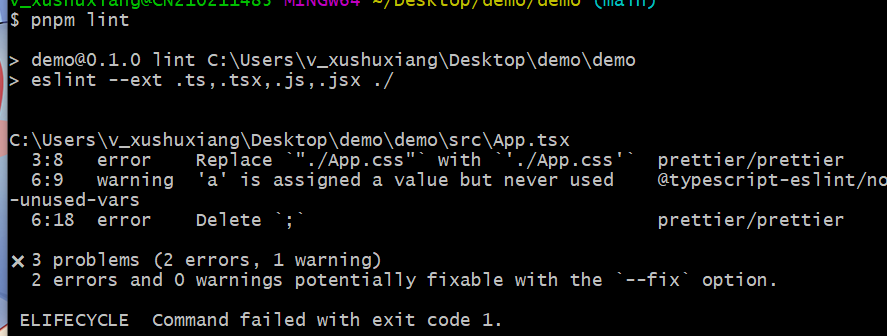
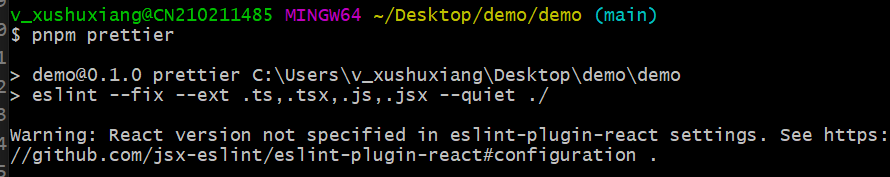
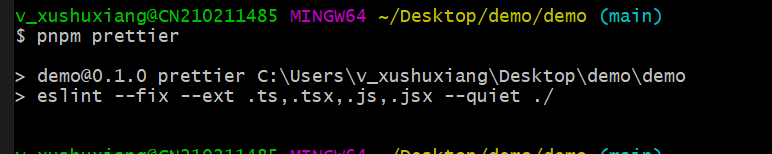
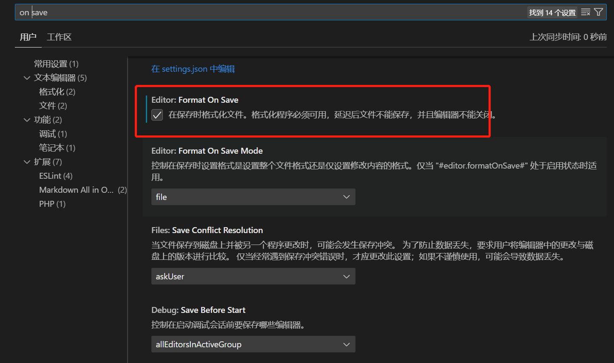
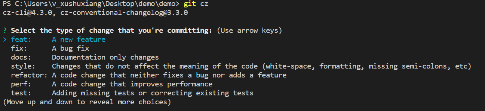
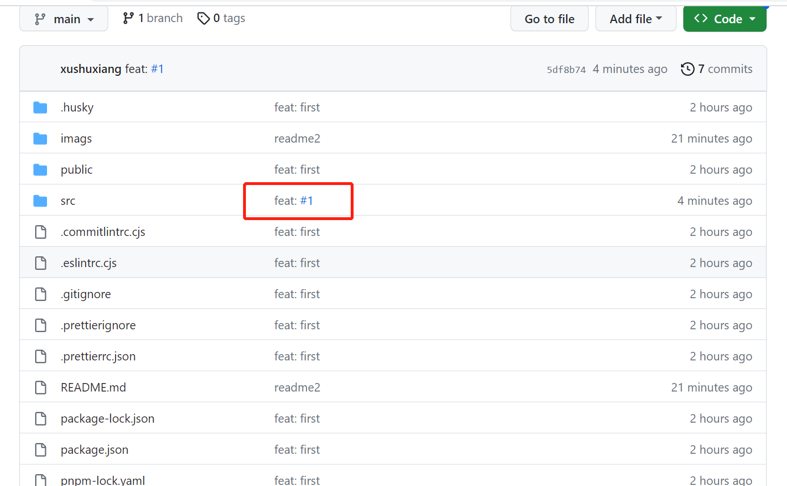
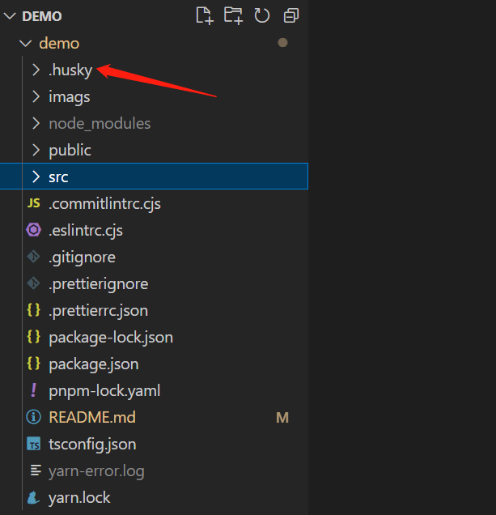
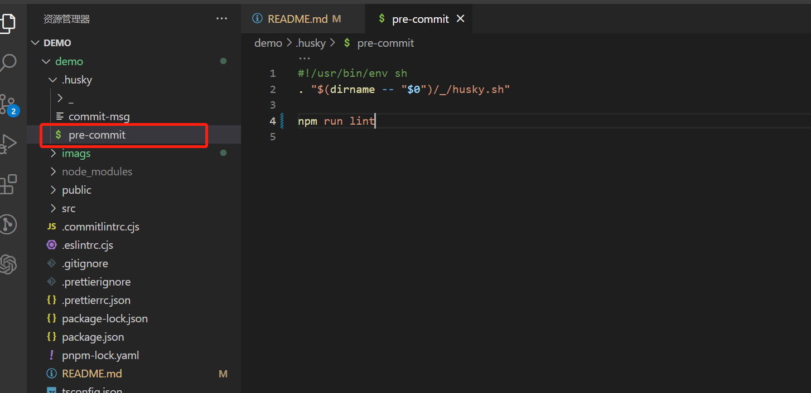
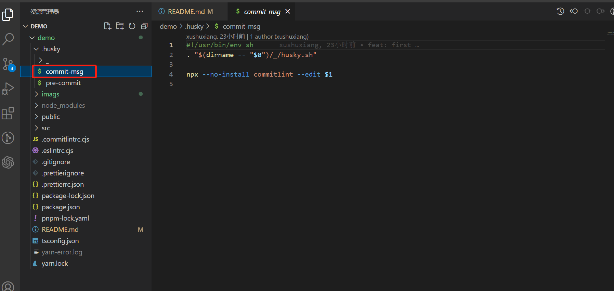

```bash
在大前端时代，前端的各种工具链穷出不断，有eslint, prettier, husky, commitlint 等
东西太多有的时候也是trouble😂😂😂,怎么正确的使用这个是每一个前端开发者都需要掌握的内容
请上车🚗🚗🚗
```

## eslint 使用

[eslint](https://zh-hans.eslint.org/docs/latest/use/getting-started)

```bash
"eslint": "^8.33.0",  // 这个是eslint的主包
"eslint-plugin-react": "^7.32.2",  // 这是react基于eslint来做的语法规范插件
"eslint-plugin-react-hooks": "^4.6.0", // 这是 react-hooks 语法基于eslint做的插件
"@typescript-eslint/eslint-plugin": "^5.50.0",  // typescript 基于eslint来做的插件
"@typescript-eslint/parser": "^5.50.0",  // typescript 基于eslint做的语法解析器，使得eslint可以约束ts语法
```

使用的以下语句来按照依赖：

```bash
pnpm i eslint eslint-plugin-react eslint-plugin-react-hooks @typescript-eslint/parser @typescript-eslint/eslint-plugin -D
```

接下来需要对 eslint 的规范写入配置文件中，可以在项目的根目录下面建立一个 `.eslintrc.cjs`

```bash
module.exports = {
    'env': {
        'node': true,   // 标志当前的环境，不然使用module.exports 会报错
        'es2021': true
    },
    extends: [
      'eslint:',  // 使用eslint推荐的语法规范
      'plugin:react/recommended',  // react推荐的语法规范
      'plugin:@typescript-eslint/recommended' // ts推荐的语法规范
    ],
    parser: '@typescript-eslint/parser',  // 使用解析器来解析ts的代码，使得eslint可以规范ts的代码
    parserOptions: {
      ecmaFeatures: {
        jsx: true  // 允许使用jsx的语法
      },
      ecmaVersion: 'latest',  // es的版本为最新版本
      sourceType: 'module'  // 代码的模块化方式，使用module的模块方式
    },
    plugins: ['react', '@typescript-eslint', 'react-hooks'],  // 使用对应的react, react-hooks, @typescript-eslint 等插件
    rules: {
      quotes: ['error', 'single'],  // 配置单引号的规则，如果不是单引号，报错
      semi: 'off',  //  不需要使用分号；
      trailingComma: 'none',  // 参数后面不允许使用分号
      arrowParens: 'avoid', // 要求箭头函数的参数使用圆括号
      tabWidth: 2,
      printWidth: 120
      'react/react-in-jsx-scope': 'off'  // 在jsx中不需要导入 react的包
    }
  }
```

接下来在 package.json 的 scripts 中加入一条命令

```bash
"lint": "eslint --ext .ts,.tsx,.js,.jsx ./" // 使用eslint 规范 ts,tsx,js,jsx的代码
```

### 效果



### 注意： eslint 查找自己配置文件的优先级如下

如果在同一目录下存在多个配置文件，ESLint 将按照以下优先顺序只使用其中一个（并不会进行合并配置）：

.eslintrc.js

.eslintrc.cjs

.eslintrc.yaml

.eslintrc.yml

.eslintrc.json

package.json

如果项目中存在多个配置文件则 eslint 先检同级下的 配置文件然后在找别的，选择原则就是就近原则。

ESLint 会自动在要检查文件的目录中寻找（ .eslintrc.\* 和 package.json 文件），并在其直系父目录中寻找，直到文件系统的根目录（/）、当前用户的主目录（~/）或指定 root: true 时停止。

*例如：*如果在你的主目录下有一个自定义的配置文件 (~/.eslintrc) ，如果没有其它配置文件时它才会被使用。

代码中的不规范的格式就暴露出来了，现在可以来修复并且格式化代码。在格式化代码方面，prettier 做的更好点

## prettier

`prettier` 是一款开源的代码格式化包，支持多种代码编写工具，常见的 `vscode, webstorm` 等，他都是支持的，那么怎么给他集成起来呢？(多语言支持 配置少 支持广泛) [prettier](https://www.prettier.cn/docs/index.html)

使用下面语句来安装依赖：

```bash
pnpm i prettier eslint-plugin-prettier eslint-config-prettier
```

```bash
"prettier": "^2.8.3",  // prettier 主包
"eslint-config-prettier": "^8.6.0",  // eslint 和prettier的共同配置
"eslint-plugin-prettier": "^4.2.1",  // 在eslint当中，使用prettier为插件，才能一起使用
```

安装好依赖后，咱们还需要在 `eslitrc.cjs`中加入 prettier 的配置如下：

```bash
{
 extends:[
 ...,
+ 'prettier', // prettier
+ 'plugin:prettier/recommended' // prettier推荐的配置
 ],
+ plugins:[...,'prettier'],
rules: {
+    'prettier/prettier': 'error', // eslint 和prettier 用prettier的错误
    }
}
```

接下来在`package.json`中添加一段脚本

```bash
+ "prettier": "eslint --fix --ext .ts,.tsx,.js,.jsx --quiet ./"
```

此时，咱们还需要配置哪些文件是不需要进行代码格式化的，所以在根目录下面建立 `.prettierignore`增加如下内容

```bash
node_modules
package.json
pnpm-lock.yaml
dist
```

### 效果



修复成功，但是这里还报了一个警告，这个的解决办法如下：

在`eslintrc.cjs`的最后增加上一段配置如下：

```bash
+ settings: {
+    react: {
+      version: 'detect'
+    }
+  }
```



配置自动格式化




### eslint 和 prettier 的区别

eslint 官网描述：

目标是提供一个插件化的 javascript 代码检测工具

prettier 官网描述：

1、一个“有态度”的代码格式化工具

2、支持大量编程语言

区别

1、eslint 针对的是 javascript，他是一个检测工具，包含 js 语法以及少部分格式问题，在 eslint 看来，语法对了就能
保证代码正常运行，格式问题属于其次；

2、prettier 属于格式化工具，它看不惯格式不统一，所以它就把 eslint 没干好的事接着干，另外，prettier 支持
包含 js 在内的**多种语言**

总结：eslint 和 prettier 这俩兄弟一个保证 js 代码质量，一个保证代码美观。

# commitizen + husky + commitlint

React 项目 commitizen + husky + commitlint，git commit 提交信息规范校验 demo，[conventional commits](https://www.conventionalcommits.org/en/v1.0.0/) 实践

- `commitizen`：使用 git cz 代替 git commit，引导用户填写规范的 commit 信息
- `husky + commitlint`：git commit 动作时，校验 commit 信息，如果不满足 commitizen 规范，无法提交

## commitizen 使用

[commitizen](https://github.com/commitizen/cz-cli) 是一个 cli 工具，用于规范化 git commit 信息，可以代替 git commit

```bash
pnpm install -g commitizen cz-conventional-changelog  # 安装规范化提交插件

"config": {
  "commitizen": {
    "path": "./node_modules/cz-conventional-changelog"
  }
}

git cz
PS C:\Users\v_xushuxiang\Desktop\demo\demo> git cz
cz-cli@4.3.0, cz-conventional-changelog@3.3.0

? Select the type of change that you're committing: feat:     A new feature
? What is the scope of this change (e.g. component or file name): (press enter to skip) test
? Write a short, imperative tense description of the change (max 88 chars):
 (11) test updata
? Provide a longer description of the change: (press enter to skip)

? Are there any breaking changes? No
? Does this change affect any open issues? No
[main 9fc4737] feat(test): test updata
 Committer: xushuxiang <v_xushuxiang@bilibili.com>
```



如图，git cz 运行后，会有如下 6 个步骤

### 1.选择提交类型(必填)

Select the type of change that you're committing: (Use arrow keys)

| 类型     | 描述                                                                                                        |
| -------- | ----------------------------------------------------------------------------------------------------------- |
| feat     | A new feature                                                                                               |
| fix      | A bug fix                                                                                                   |
| docs     | Documentation only changes                                                                                  |
| style    | Changes that do not affect the meaning of the code (white-space, formatting, missing semi-colons, etc)      |
| refactor | A code change that neither fixes a bug nor adds a feature                                                   |
| perf     | A code change that improves performance                                                                     |
| test     | Adding missing tests or correcting existing tests                                                           |
| build    | Changes that affect the build system or external dependencies (example scopes: gulp, broccoli, npm)         |
| ci       | Changes to our CI configuration files and scripts (example scopes: Travis, Circle, BrowserStack, SauceLabs) |
| chore    | Other changes that don't modify src or test files                                                           |
| revert   | Reverts a previous commit                                                                                   |

### 2.选择 scope 模块名(选填)

What is the scope of this change (e.g. component or file name): (press enter to skip)

### 3.填写精炼的提交信息(必填)

Write a short, imperative tense description of the change (max 86 chars):

### 4.填写补充信息(选填)

Provide a longer description of the change: (press enter to skip)

### 5.选择是否有破坏性更新(默认 no)

Are there any breaking changes?

### 6.是否关联是 open 状态的 issue(默认 no)

Does this change affect any open issues?

可以关闭 github issue，**但注意 commit 信息里面的末尾也要加 '(#issue 编号)'**，这样在 github 体验更好

## docs 类型提交

```bash
# 修改 README.md
git add . # 添加到 git
git cz # 提交
# ? Select the type of change that you're committing: docs:     Documentation only changes
# ? What is the scope of this change (e.g. component or file name): (press enter to skip) readme
# ? Write a short, imperative tense description of the change (max 86 chars):
# (46) update readme.md, add init project description
# ? Provide a longer description of the change: (press enter to skip)

# ? Are there any breaking changes? No
# ? Does this change affect any open issues? No
# [main caae82e] docs(readme): update readme.md, add init project description
# 1 file changed, 7 insertions(+)
# C:\Users\v_xushuxiang\Desktop\demo\demo> demo %
```

查看提交信息

```bash
PS C:\Users\v_xushuxiang\Desktop\demo\demo> % git log
commit caae82ec7beb66423f190ab86a6343447b250046 (HEAD -> main)
Author: v_xushuxiang <v_xushuxiang@bilibili.com>
Date:   Thu Oct 14 07:17:31 2021 +0800

    docs(readme): update readme.md, add init project description
```

## fix 类型提交

在 github 仓库提交一个 issue，看是否提交 fix 时，可以关联这个 issue

创建一个 issue [fix type 提交类型关联测试 1](https://github.com/xushux/demo/issues?q=is%3Aissue+is%3Aclosed)

```bash
git cz
cz-cli@4.2.4, cz-conventional-changelog@3.2.0

# ? Select the type of change that you're committing: fix:      A bug fix
# ? What is the scope of this change (e.g. component or file name): (press enter to skip) tests
# ? Write a short, imperative tense description of the change (max 88 chars):
#  (17) update tests (#2)
# ? Provide a longer description of the change: (press enter to skip)

# ? Are there any breaking changes? No
# ? Does this change affect any open issues? No
# [main 821cd42] fix(tests): update tests (#2)
#  1 file changed, 2 insertions(+)

#  fix(tests): update tests (#2)
```

提交时选择是否影响了 open 状态的 issue，如果选择了，github 会自动关闭该 issue

```bash
PS C:\Users\v_xushuxiang\Desktop\demo\demo> % git cz
cz-cli@4.2.4, cz-conventional-changelog@3.2.0

# ? Select the type of change that you're committing: fix:      A bug fix
# ? What is the scope of this change (e.g. component or file name): (press enter to skip) public
# ? Write a short, imperative tense description of the change (max 87 chars):
#  (28) auto close github issue test
# ? Provide a longer description of the change: (press enter to skip)

# ? Are there any breaking changes? No
# ? Does this change affect any open issues? Yes
# ? If issues are closed, the commit requires a body. Please enter a longer description of the commit itself:
#  try to fix issue 2, just a msg
# ? Add issue references (e.g. "fix #123", "re #123".):
#  fix #2
# [main 146e7b9] fix(public): auto close github issue test
#  1 file changed, 1 insertion(+)
# PS C:\Users\v_xushuxiang\Desktop\demo\demo> %
```

注意：如果 commit 信息里面后面不加 (#issue 编号)，git commit 表面是看不出来的，只有点击去才行



该提交会关闭 #1 issue，注意 issue 详情里会自动关联 commit 信息中有 #issue 编号的提交，如下图，


## husky + commitlint 提交校验

[commitlint](https://github.com/conventional-changelog/commitlint) 结合 husky 可以在 git commit 时校验 commit 信息是否符合规范

### husky 安装

1. 安装 husky

```bash
pnpm install husky --save-dev
```

2. 安装 husky git hooks

我们在终端通过 `npx husky install` 来初始化 `husky`



3. 测试 husky 钩子作用，添加 pre-commit 钩子

我们还需要生成`pre-commit`钩子的时候来执行`npm run lint`

```bash
npx husky add .husky/pre-commit "npm run lint"  // 在commit之前先执行 npm run lint脚本
```

安装完成后，会在 `.husky` 目录中新增一个文件 `pre-commit`



需要在 package.json 注册 prepare 命令，在项目进行 pnpm i 之后就行 Huksy 的安装，命令如下:

```bash
+ "prepare": "husky install"
```

上面是自己手动 npx husky install 的，需要让后面使用配置的人自动来初始化 husky

但是大家如果再深入一步，就会想到 🤔🤔🤔。既然我内容都管控好了，是不是需要把 commit -m 'xxx' 中的 msg 也管控下呀 😉😉😉

## commitlint 安装配置

```bash
pnpm i commitlint @commitlint/cli @commitlint/config-conventional -D
```

包意思解析

```bash
 "@commitlint/cli": "^17.4.2", // 规范提交信息
 "@commitlint/config-conventional": "^17.4.2",  // commitlint 常用的msg配置
 "commitlint": "^17.4.2" // commitlint 主包
```

根目录添加一个 `.commitlintrc.cjs`来配置`commitlint`的配置:

```bash
module.exports = {
  extends: ['@commitlint/config-conventional']
}
```

还需要在 git hooks 中添加一个方法

```bash
npx husky add .husky/commit-msg 'npx --no-install commitlint --edit "$1"'
```

然后会在`.husky`中生成一个新的文件`commit-msg`



测试

```bash
$ git add .
$ git commit -m 'xxx'

> testproject@0.1.0 lint
> eslint --ext .ts,.tsx,.js,.jsx ./

⧗   input: xxx
✖   subject may not be empty [subject-empty]
✖   type may not be empty [type-empty]

✖   found 2 problems, 0 warnings
ⓘ   Get help: https://github.com/conventional-changelog/commitlint/#what-is-commitlint

husky - commit-msg hook exited with code 1 (error)

```

提示缺少 subject 就是提交信息、type 就是提交类型，按照规范提交就 ok 了

# lint-staged

对于细心的同学可能会发现，我们每一次提交都会 `prettier`整个目录的所有问题，大大的降低了咱们编码的速度。所以咱们还需要做一件事情，那就是 只格式化需要提交的代码，其他的就不需要格式化了

使用下面命令安装依赖

```bash
pnpm i lint-staged -D
```

然后在 package.json 中新增如下内容

```bash
+ "lint-staged": {
+     "**/*.{js,jsx,tsx,ts}": [
+          "eslint --fix"
+       ]
+    }
```

还需要对 pre-commit 这个钩子就行修改内容

```bash
#!/usr/bin/env sh
. "$(dirname -- "$0")/_/husky.sh"

- npm run lint
+ npx --no -- lint-staged
```

## 根据 commit 信息生成 changelog

### 手动生成 changelog(不推荐)

注意：该方法结合 npm version 时，生成会有问题，建议使用后面的 standard-version 自动生成，自动 tag，自动 commit

```
$ pnpm install -g conventional-changelog-cli
$ cd my-project
$ conventional-changelog -p angular -i CHANGELOG.md -s
```

注意：默认版本是 package.json 中的 version 参数: "version": "0.1.0", 如果版本变更，需要使用 npm version '版本号'，修改版本号，再生成

```bash
npm version 0.2.0 # 修改 package.json 版本号，并打一个 tag，待 push，commit 信息 0.0.2
git push origin --tags # push tags
git commit --amend -m 'feat(version):version to 0.2.0' # commit 信息不对，导致生成 log 有问题，需要修改
# 修上次提交记录，把 0.2.0 改为标准格式再生成，就可以生成 change log 了
```

npm version 时加上比较好的注释试试

```bash
PS C:\Users\v_xushuxiang\Desktop\demo\demo> % npm version 0.4.0 -m 'feat(version):0.4.0 tag remark'
v0.4.0
PS C:\Users\v_xushuxiang\Desktop\demo\demo> % git log
commit 0fdcd82353f3907c4a31e470402b6dce743b4b11 (HEAD -> main, tag: v0.4.0)
Author: v_xushuxiang <v_xushuxiang@bilibili.com>
Date:   Fri Oct 15 06:58:20 2021 +0800

    feat(version):0.4.0 tag remark

# 再次生成 changelog 又不行了，空白
```

## standard-version（自动生成、打 tag）

上面的例子中，npm run version 更新版本号会直接提交，导致且 commit 信息就是版本号，不符合 commitizen 规范。导致手动生成 log 时，会是空白。[standard-version](https://github.com/conventional-changelog/standard-version) 就很好的解决了这个问题。安装后，只需要 npm run release，就可以有 npm run version 的功能，而且提交信息是标准的 commitizen 规范，而且自动生成 changelog 自动打 tag，自动 commit。你只需要 push 即可。

```bash
pnpm install standard-version --save-dev
```

scripts 设置

```js
// scripts
"release": "standard-version"
```

```bash
$ npm run release

> demo@0.1.0 release
> standard-version

√ bumping version in package.json from 0.1.0 to 0.1.1
√ bumping version in package-lock.json from 0.1.0 to 0.1.1
√ created CHANGELOG.md
√ outputting changes to CHANGELOG.md
√ committing package-lock.json and package.json and CHANGELOG.md
√ tagging release v0.1.1
i Run `git push --follow-tags origin main` to publish

# git push
# git push --tags
```

需要注意的是：**CHANGELOG.md 是追加写入内容的，如果你之前没有对应的内容或删了之前的内容，会导致生成的内容较少，或者不完整。**

### release 特定版本

```bash
# 0.4.1
npm run release # 0.4.1 => 0.4.2
npm run release -- --prerelease # 0.4.2 to 0.4.3-0
npm run release # 0.4.3-0 to 0.4.3
npm run release -- --prerelease alpha # 0.4.3 to 0.4.4-alpha.0

# patch、minor、major
npm run release -- --release-as minor  # 0.4.4-alpha.0 to 0.5.0
npm run release -- --release-as patch # 0.5.0 to 0.5.1
npm run release -- --release-as major # 0.5.1 to 1.0.0
npm run release -- --release-as prepatch # 1.0.0 to 1.0.1-0
npm run release -- --release-as preminor # 1.0.1-0 to 1.1.0-0
npm run release -- --release-as premajor # 1.1.0-0 to 2.0.0-0

# 手动指定版本
npm run release -- --release-as 2.1.3-alpha.1 # 2.0.0-0 to 2.1.3-alpha.1
# ✔ bumping version in package.json from 2.0.0-0 to 2.1.3-alpha.1
# ✔ bumping version in package-lock.json from 2.0.0-0 to 2.1.3-alpha.1
# ✔ tagging release v2.1.3-alpha.1

npm run release # 2.1.3-alpha.1 to 2.2.0
```

对于版本号信息，参考 [npm version](https://docs.npmjs.com/cli/v7/commands/npm-version) 文档:

# ES2016（ES7）
1. Array.prototype.includes()  
includes( )  方法用来判断一个数组是否包含一个指定的值，如果包含则返回 true，否则返回 false。

语法及示例 
```bash
const arr = ['Barry','Lishen','Jenny','Chany'];
 
arr.includes(value,index)
```
value，需要查找的元素值。index 可选 ，从 index 索引处开始查找 value。如果为负值，则按升序从 arr.length + index 的索引开始搜索。默认为 0。
```bash
const arr = ['Barry', 'Lishen', 'Jenny', 'Chany'];
 
console.log(arr.includes('Barry')); // true
console.log(arr.includes('Barry',0)); // true
console.log(arr.includes('Barry',1)); // false
console.log(arr.includes('Barry',2)); // false
console.log(arr.includes('Barry',-1)); // false
console.log(arr.includes('Barry',-2)); // false
 
数组的长度是 4
index 是 -5
computed index 是 4 + (-5) = -1
如果计算出的索引小于 0，则整个数组都会被搜索。 所以下面为 true
 
console.log(arr.includes('Barry',-5)); // true
```
注意点:

使用 includes()查找字符串是区分大小写的。

使用 includes()只能判断简单类型的数据，对于复杂类型的数据，比如对象类型的数组，二维数组，这些是无法判断的.

能识别NaN，indexOf是不能识别NaN的
```bash
    const arr = ['Barry', 'Lishen', 'Jenny', NaN, 'Chany'];
 
    console.log(arr.includes(NaN)); // true
    console.log(arr.indexOf(NaN)); // -1
```
如果只想知道某个值是否在数组中存在，而并不关心它的索引位置，建议使用includes(),如果想获取一个值在数组中的位置，那么使用indexOf方法。 

2. 幂运算符 **
Math.pow( )  
```bash
console.log(Math.pow(2, 10)); // 1024
```

幂运算符 ** 
```bash
console.log(2 ** 10); // 1024
```

基本求幂 
```bash
    console.log(2 ** 3); // 8
    console.log(3 ** 2); // 9
    console.log(3 ** 2.5); // 15.588457268119896
    console.log(10 ** -1); // 0.1
    console.log(NaN ** 4); // NaN
```
注意点：
幂运算符的两个*号之间不能出现空格，否则语法会报错。

# ES2017（ES8）
1. Object.values()

  Object.values 方法返回一个数组，成员是参数对象自身的（不含继承的）所有可遍历（enumerable）属性的键值。

```bash
    const obj = {
      name: "Barry",
      age: 18,
      height: 185,
      money: 1000000000
    }
    console.log(Object.values(obj)); // ['Barry', 18, 185, 1000000000]
```

1. Object.entries()

Object.entries() 方法返回一个数组，成员是参数对象自身的（不含继承的）所有可遍历属性的键值对数组。
```bash
    const obj = {
      name: "Barry",
      age: 18,
      height: 185,
      money: 1000000000
    }
    console.log(Object.entries(obj)); // [['name','Barry'], ['age',18], ['height',185], ['money',100000000]]
```

1. String.prototype.padStart

  str.padStart(targetLength , padString)

targetLength

        当前字符串需要填充到的目标长度。如果这个数值小于当前字符串的长度，则返回当前字符串本身。

padString 可选

        填充字符串。如果字符串太长，使填充后的字符串长度超过了目标长度，则只保留最左侧的部分，其他部分会被截断。此参数的默认值为 " "
```bash
    const str = "ABC";
 
    console.log(str.padStart(10))  // "       ABC"
    console.log(str.padStart(10, 'foo')) // "foofoofABC"
    console.log(str.padStart(6, '123456')) // "123ABC"
    console.log(str.padStart(8, '0')) // "00000ABC"
    console.log(str.padStart(1)) // "ABC"
```
应用场景:
数字替换(手机号，银行卡号等）
```bash
    const tel = '18737740333';
 
    function formatTel (tel) {
      return tel.slice(-4).padStart(tel.length, '*')
    }
 
    console.log(formatTel(tel));  // *******0333
```

1. String.prototype.padEnd
把指定字符串填充到字符串尾部，返回新字符串。语法同 String.prototype.padStart
```bash
    const str = "ABC";
 
    console.log(str.padEnd(10)) // "ABC       "
    console.log(str.padEnd(10, 'foo')) // "ABCfoofoof"
    console.log(str.padEnd(6, '123456')) // "ABC123"
    console.log(str.padEnd(1))  // "ABC"
```

# ES2018（ES9）
1. Object Rest & Spread
这块代码展示了 spread 语法，可以把 input 对象的数据都拓展到 output 对象，这个功能很实用。需要注意的是，如果存在相同的属性名，只有最后一个会生效。
```bash
    const input = {
      a: 1,
      b: 2,
      c: 3
    }
 
    const output = {
      ...input,
      d: 4
    }
 
    console.log(output)  // {a: 1, b: 2, c: 3, d: 4}
```

# ES2019（ES10）
1. Object.fromEntries()

方法 Object.fromEntries() 把键值对列表转换为一个对象，这个方法是和 Object.entries() 相对的。

Object 转换操作   

```bash
const obj = {
    name: 'jimmy',
    age: 18
}
const entries = Object.entries(obj)
console.log(entries)
// [Array(2), Array(2)]
 
// ES10
const fromEntries = Object.fromEntries(entries)
console.log(fromEntries)
// {name: "jimmy", age: 18}
```

过滤:

```bash
    const course = {
      math: 80,
      english: 85,
      chinese: 90
    }
 
    const res = Object.entries(course).filter(([key, val]) => val > 80);
    console.log(res); // [ [ 'english', 85 ], [ 'chinese', 90 ] ]
    console.log(Object.fromEntries(res)); //{english: 85, chinese: 90}
```

2. Array.prototype.flat()

```bash
let newArray = arr.flat( depth )
```
depth 可选， 指定要提取嵌套数组的结构深度，默认值为 1。 

demo: flat()  方法会按照一个可指定的深度递归遍历数组，并将所有元素与遍历到的子数组中的元素合并为一个新数组返回。
```bash
const arr1 = [0, 1, 2, [3, 4]];
console.log(arr1.flat());  //  [0, 1, 2, 3, 4]
const arr2 = [0, 1, 2, [[[3, 4]]]];
console.log(arr2.flat(2));  //  [0, 1, 2, [3, 4]]
 
//使用 Infinity，可展开任意深度的嵌套数组
var arr4 = [1, 2, [3, 4, [5, 6, [7, 8, [9, 10]]]]];
arr4.flat(Infinity); // [1, 2, 3, 4, 5, 6, 7, 8, 9, 10]
 
// `flat()` 方法会移除数组中的空项:
var arr5 = [1, 2, , 4, 5];
arr5.flat(); // [1, 2, 4, 5]
```

3. Array.prototype.flatMap()

对比下 map 和 flatMap 的区别

```bash
let arr = ['今天天气不错', '', '早上好']
arr.map(s => s.split(''))
// [["今", "天", "天", "气", "不", "错"],[""],["早", "上", "好"]]
arr.flatMap(s => s.split(''))
// ["今", "天", "天", "气", "不", "错", "", "早", "上", "好"]
```

4. String.prototype.trimStart()

trimStart() 方法从字符串的开头删除空格，trimLeft()是此方法的别名。    

String.prototype.trimEnd(), 就不介绍了，和下面类似；
```bash
let str = '   foo  '
console.log(str.length) // 8
str = str.trimStart() // 或str.trimLeft()
console.log(str.length) // 5
```

# ES2020（ES11）
1. 空值合并运算符（Nullish coalescing Operator）

  空值合并操作符（ ?? ）是一个逻辑操作符，当左侧的操作数为 null或者undefined时，返回其右侧操作数，否则返回左侧操作数。   

  与逻辑或操作符（||）不同，逻辑或操作符会在左侧操作数为假值时返回右侧操作数。也就是说，如果使用 || 来为某些变量设置默认值，可能会遇到意料之外的行为。比如为假值（例如'',0,NaN,false）时.
```bash
    const name = "" ?? "Barry"
    const name2 = "" || "Barry"
 
    console.log(name); // ""
    console.log(name2); // "Barry"
 
    const age = 0 ?? 18;
    const age2 = 0 || 18;
    console.log(age); // 0
    console.log(age2); // 18
```

# ES2021（ES12）
1. 逻辑运算符和赋值表达式（&&=，||=，??=）

逻辑与赋值 x &&= y 等效于：

```bash
x && (x = y);
```

上面的意思是，当x为真时，x=y。具体请看下面的示例: 
```bash
    let a = 1;
    let b = 0;
 
    a &&= 2;
 
    b &&= 2;
 
    console.log(a); // 2
    console.log(b); // 0
```

||=

逻辑或赋值（x ||= y）运算仅在 x 为 false 时赋值。x ||= y 等同于：x || (x = y);
```bash
    const a = { duration: 50, title: "" }
 
    a.duration ||= 20;
    console.log(a.duration);  // 50
 
    a.title ||= "Barry"
    
    console.log(a); // { duration: 50, title: "Barry" }
```

??=

逻辑空赋值运算符 ( x ??= y ) 仅在 x 是 null 或 undefined 时对其赋值。

x ??= y 等价于：x ?? (x = y);

```bash
const a = { duration: 50 };
 
a.duration ??= 10;
console.log(a.duration); // 50
 
a.speed ??= 25;
console.log(a.speed); // 25
```

2. String.prototype.replaceAll()

replaceAll()  方法返回一个新字符串，新字符串中所有满足 pattern 的部分都会被replacement 替换。pattern 可以是一个字符串或一个 RegExp，replacement可以是一个字符串或一个在每次匹配被调用的函数。

原始字符串保持不变。

```bash
    const str = 'aabbccdd';
    const newStr = str.replaceAll('b', '*')
    console.log(newStr); // 'aa**bbccdd'
```

3. 数字分隔符

欧美语言中，较长的数值允许每三位添加一个分隔符（通常是一个逗号），增加数值的可读性。比如，1000 可以写作1,000。

ES2021中允许 JavaScript 的数值使用下划线（_）作为分隔符。
```bash
let budget = 1_000_000_000_000;
budget === 10 ** 12 // true
```

这个数值分隔符没有指定间隔的位数，也就是说，可以每三位添加一个分隔符，也可以每一位、每两位、每四位添加一个。 
```bash
123_00 === 12_300 // true
 
12345_00 === 123_4500 // true
12345_00 === 1_234_500 // true
```

小数和科学计数法也可以使用数值分隔符。 

```bash
// 小数
0.000_001
 
// 科学计数法
1e10_000
```

数值分隔符有几个使用注意点。
```bash
不能放在数值的最前面（leading）或最后面（trailing）。

不能两个或两个以上的分隔符连在一起。

小数点的前后不能有分隔符。

科学计数法里面，表示指数的e或E前后不能有分隔符。

// 全部报错
3_.141
3._141
1_e12
1e_12
123__456
_1464301
1464301_
```

4. Promise.any

方法接受一组 Promise 实例作为参数，包装成一个新的 Promise 实例返回。
```bash
    const promise1 = () => {
      return new Promise((resolve, reject) => {
        setTimeout(() => {
          resolve('promise1')
        }, 3000);
      })
    }
 
    const promise2 = () => {
      return new Promise((resolve, reject) => {
        setTimeout(() => {
          resolve('promise2')
        }, 2000);
      })
    }
 
    const promise3 = () => {
      return new Promise((resolve, reject) => {
        setTimeout(() => {
          reject('promise3 error')
        }, 1000);
      })
    }
 
    Promise.any([promise1(), promise2(), promise3(),]).then(res => {
       // 只要有一个请求成功 就会返回第一个请求成功的 
      console.log('res', res); // 会返回promise2
    }).catch(err => {
      console.log('err', err);
    })
```
Promise.any() 跟 Promise.race() 方法很像，只有一点不同，就是 Promise.any() 不会因为某个 Promise 变成 rejected 状态而结束，必须等到所有参数 Promise 变成 rejected 状态才会结束。 


1.  AnyRule
    这是一个用来快速检索常用正则表达式的插件，希望能给大家在繁忙的开发过程中带来一丁点的效率提升。

2.  Path Intellisense
    该扩展可以自动补全代码中的路径和文件名。例如前端的静态文件引入路径填写修改。

3.  GitLens
    这个工具可以清楚的看见代码是谁写的，还有很多功能，也是团队开发中必安的插件。

4.  chatgpt 中文版
    无需注册，无需翻墙

5.  Quokka.js
    它可以用于快速构建 JavaScript / TypeScript 原型设计的开发人员生产力工具。当您输入时，运行时，值会更新并显示在您的代码旁边的 IDE 中。
6.  Import Cost
    此工具将在编辑器中内联显示导入包的大小。作为一个有抱负的前端开发者，我们应该对导入包的体积敏感，从而优化性能。
7.  Image preview
    当我们在 HTML 或 CSS 中导入图像时，它会在侧边栏中显示图像。通过这个特性，我们可以快速观察代码是否写得正确。
8.  TODO
    通常在进行编码时，你认为可能有更好的方法来执行相同的操作。 这时你留下注释 // TODO: 需要重构 或其他相关的东西。 但是你很容易忘记了这个注释，并将你的代码推送到主版本库(master) 或者生产环境(production)。
9.  Indent Rainbow
    彩虹缩进(Indent Rainbow)扩展为每个缩进层级用四种不同颜色交替着色。
10. Web Gradients
    [Web Gradients](https://webgradients.com/)
    在这里我们可以实现网站漂亮的渐变背景颜色的设计与合成。

11. learn-anything
    [learn-anything](https://learn-anything.xyz)
    当我们想学习一些东西时，这里提供详细的路线。
