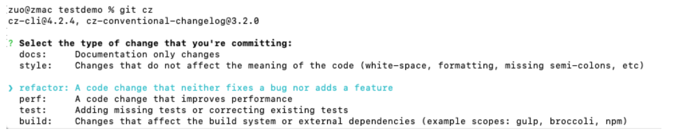
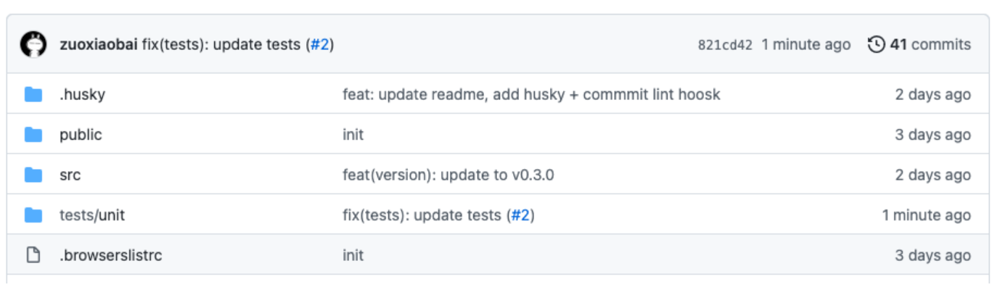

```bash
在大前端时代，前端的各种工具链穷出不断，有eslint, prettier, husky, commitlint 等, 东西太多有的时候也是trouble😂😂😂,怎么正确的使用这个是每一个前端开发者都需要掌握的内容，请上车🚗🚗🚗
```

## eslint 使用
本次前端工程化的项目是基于react来的，vue用户也是同样的道理，只是有个别的依赖包不一样。

```bash
"eslint": "^8.33.0",  // 这个是eslint的主包
"eslint-plugin-react": "^7.32.2",  // 这是react基于eslint来做的语法规范插件
"eslint-plugin-react-hooks": "^4.6.0", // 这是 react-hooks 语法基于eslint做的插件
"@typescript-eslint/eslint-plugin": "^5.50.0",  // typescript 基于eslint来做的插件
"@typescript-eslint/parser": "^5.50.0",  // typescript 基于eslint做的语法解析器，使得eslint可以约束ts语法
```

使用的以下语句来按照依赖：

```bash
pnpm i eslint eslint-plugin-react eslint-plugin-react-hooks @typescript-eslint/parser @typescript-eslint/eslint-plugin -D
```

接下来需要对eslint的规范写入配置文件中，可以在项目的根目录下面建立一个 `.eslintrc.cjs`

```bash
module.exports = {
    'env': {
        'node': true,   // 标志当前的环境，不然使用module.exports 会报错
        'es2021': true
    },
    extends: [
      'eslint:recommended',  // 使用eslint推荐的语法规范
      'plugin:react/recommended',  // react推荐的语法规范
      'plugin:@typescript-eslint/recommended' // ts推荐的语法规范
    ],
    parser: '@typescript-eslint/parser',  // 使用解析器来解析ts的代码，使得eslint可以规范ts的代码
    parserOptions: {
      ecmaFeatures: {
        jsx: true  // 允许使用jsx的语法
      },
      ecmaVersion: 'latest',  // es的版本为最新版本
      sourceType: 'module'  // 代码的模块化方式，使用module的模块方式
    },
    plugins: ['react', '@typescript-eslint', 'react-hooks'],  // 使用对应的react, react-hooks, @typescript-eslint 等插件
    rules: {
      quotes: ['error', 'single'],  // 配置单引号的规则，如果不是单引号，报错
      semi: 'off',  //  不需要使用分号；
      'react/react-in-jsx-scope': 'off'  // 在jsx中不需要导入 react的包
    }
  }
```

接下来在package.json 的 scripts 中加入一条命令

```bash
"lint": "eslint --ext .ts,.tsx,.js,.jsx ./" // 使用eslint 规范 ts,tsx,js,jsx的代码
```

### 效果


代码中的不规范的格式就暴露出来了，现在可以来修复并且格式化代码。但是在格式化代码方面，prettier做的更好点，所以咱们来使用 prettier来进行代码格式化

## prettier

`prettier` 是一款开源的代码格式化包，支持多种代码编写工具，常见的 `vscode, webstorm` 等，他都是支持的，那么怎么给他集成起来呢？

使用下面语句来安装依赖：

```bash
pnpm i prettier eslint-plugin-prettier eslint-config-prettier
```

下面来解释下，这些包是干啥用的，不然稀里糊涂安装了它

```bash
"prettier": "^2.8.3",  // prettier 主包
"eslint-config-prettier": "^8.6.0",  // eslint 和prettier的共同配置
"eslint-plugin-prettier": "^4.2.1",  // 在eslint当中，使用prettier为插件，才能一起使用
```

安装好依赖后，咱们还需要在 `eslitrc.cjs`中加入prettier的配置如下：

```bash
{
 extends:[
 ...,
+ 'prettier', // prettier
+ 'plugin:prettier/recommended' // prettier推荐的配置  
 ],
+ plugins:[...,'prettier'],
rules: {
+    'prettier/prettier': 'error', // eslint 和prettier 用prettier的错误
    }
}
```

接下来在`package.json`中添加一段脚本

```bash
+ "prettier": "eslint --fix --ext .ts,.tsx,.js,.jsx --quiet ./"
```

此时，咱们还需要配置哪些文件是不需要进行代码格式化的，所以在根目录下面建立 `.prettierignore`增加如下内容

```bash
node_modules
package.json
pnpm-lock.yaml
dist
```

### 效果


修复成功，但是这里还报了一个警告，这个的解决办法如下：

在`eslintrc.cjs`的最后增加上一段配置如下：

```bash
+ settings: {
+    react: {
+      version: 'detect'
+    }
+  }
```


配置自动格式化


# commitizen-practice-demo

React 项目 commitizen + husky + commitlint，git commit 提交信息规范校验 demo，[conventional commits](https://www.conventionalcommits.org/en/v1.0.0/) 实践

- `commitizen`：使用 git cz 代替 git commit，引导用户填写规范的 commit 信息
- `husky + commitlint`：git commit 动作时，校验 commit 信息，如果不满足 commitizen 规范，无法提交

## 初始化项目

```bash
npx create-react-app testproject --template typescript
```

## commitizen 使用

[commitizen](https://github.com/commitizen/cz-cli) 是一个 cli 工具，用于规范化 git commit 信息，可以代替 git commit

```bash
pnpm install -g commitizen cz-conventional-changelog  # 安装规范化提交插件
echo '{"path": "cz-conventional-changelog"}' > ~/.czrc # 配置
git cz
# ? Select the type of change that you're committing: docs:     Documentation only changes
# ? What is the scope of this change (e.g. component or file name): (press enter to skip) readme
# ? Write a short, imperative tense description of the change (max 86 chars):
# (46) update readme.md, add init project description
# ? Provide a longer description of the change: (press enter to skip)

# ? Are there any breaking changes? No
# ? Does this change affect any open issues? No
# [main caae82e] docs(readme): update readme.md, add init project description
# 1 file changed, 7 insertions(+)
# zuo@zmac comitizen-practice-demo %
```



如图，git cz 运行后，会有如下 6 个步骤

### 1.选择提交类型(必填)

Select the type of change that you're committing: (Use arrow keys)

| 类型     | 描述                                                                                                        |
| -------- | ----------------------------------------------------------------------------------------------------------- |
| feat     | A new feature                                                                                               |
| fix      | A bug fix                                                                                                   |
| docs     | Documentation only changes                                                                                  |
| style    | Changes that do not affect the meaning of the code (white-space, formatting, missing semi-colons, etc)      |
| refactor | A code change that neither fixes a bug nor adds a feature                                                   |
| perf     | A code change that improves performance                                                                     |
| test     | Adding missing tests or correcting existing tests                                                           |
| build    | Changes that affect the build system or external dependencies (example scopes: gulp, broccoli, npm)         |
| ci       | Changes to our CI configuration files and scripts (example scopes: Travis, Circle, BrowserStack, SauceLabs) |
| chore    | Other changes that don't modify src or test files                                                           |
| revert   | Reverts a previous commit                                                                                   |

### 2.选择 scope 模块名(选填)

What is the scope of this change (e.g. component or file name): (press enter to skip)

### 3.填写精炼的提交信息(必填)

Write a short, imperative tense description of the change (max 86 chars):

### 4.填写补充信息(选填)

Provide a longer description of the change: (press enter to skip)

### 5.选择是否有破坏性更新(默认 no)

Are there any breaking changes?

### 6.是否关联是 open 状态的 issue(默认 no)

Does this change affect any open issues?

可以关闭 github issue，**但注意 commit 信息里面的末尾也要加 '(#issue 编号)'**，这样在 github 体验更好

## docs 类型提交

```bash
# 修改 README.md
git add . # 添加到 git
git cz # 提交
# ? Select the type of change that you're committing: docs:     Documentation only changes
# ? What is the scope of this change (e.g. component or file name): (press enter to skip) readme
# ? Write a short, imperative tense description of the change (max 86 chars):
# (46) update readme.md, add init project description
# ? Provide a longer description of the change: (press enter to skip)

# ? Are there any breaking changes? No
# ? Does this change affect any open issues? No
# [main caae82e] docs(readme): update readme.md, add init project description
# 1 file changed, 7 insertions(+)
# zuo@zmac comitizen-practice-demo %
```

查看提交信息

```bash
zuo@zmac comitizen-practice-demo % git log
commit caae82ec7beb66423f190ab86a6343447b250046 (HEAD -> main)
Author: zuoxiaobai <guoqzuo@gmail.com>
Date:   Thu Oct 14 07:17:31 2021 +0800

    docs(readme): update readme.md, add init project description
```

## fix 类型提交

在 github 仓库提交一个 issue，看是否提交 fix 时，可以关联这个 issue

创建一个 issue [fix type 提交类型关联测试 1](https://github.com/xushux/demo/issues?q=is%3Aissue+is%3Aclosed)

```bash
git cz
cz-cli@4.2.4, cz-conventional-changelog@3.2.0

# ? Select the type of change that you're committing: fix:      A bug fix
# ? What is the scope of this change (e.g. component or file name): (press enter to skip) tests
# ? Write a short, imperative tense description of the change (max 88 chars):
#  (17) update tests (#2)
# ? Provide a longer description of the change: (press enter to skip)

# ? Are there any breaking changes? No
# ? Does this change affect any open issues? No
# [main 821cd42] fix(tests): update tests (#2)
#  1 file changed, 2 insertions(+)

#  fix(tests): update tests (#2)
```



提交时选择是否影响了 open 状态的 issue，如果选择了，github 会自动关闭该 issue

```bash
zuo@zmac comitizen-practice-demo % git cz
cz-cli@4.2.4, cz-conventional-changelog@3.2.0

# ? Select the type of change that you're committing: fix:      A bug fix
# ? What is the scope of this change (e.g. component or file name): (press enter to skip) public
# ? Write a short, imperative tense description of the change (max 87 chars):
#  (28) auto close github issue test
# ? Provide a longer description of the change: (press enter to skip)

# ? Are there any breaking changes? No
# ? Does this change affect any open issues? Yes
# ? If issues are closed, the commit requires a body. Please enter a longer description of the commit itself:
#  try to fix issue 2, just a msg
# ? Add issue references (e.g. "fix #123", "re #123".):
#  fix #2
# [main 146e7b9] fix(public): auto close github issue test
#  1 file changed, 1 insertion(+)
# zuo@zmac comitizen-practice-demo %
```

注意：如果 commit 信息里面后面不加 (#issue 编号)，git commit 表面是看不出来的，只有点击去才行


该提交会关闭 #1 issue，注意 issue 详情里会自动关联 commit 信息中有 #issue 编号的提交，如下图，


## husky + commitlint 提交校验

[commitlint](https://github.com/conventional-changelog/commitlint) 结合 husky 可以在 git commit 时校验 commit 信息是否符合规范

### husk 安装

1. 安装 husky

```bash
pnpm install husky --save-dev
```

2. 安装 husky git hooks

```bash
# 方法1：
npx husky install
# 方法2：配置 package.json, scripts："prepare": "husky install"
npm run prepare

# husky - Git hooks installed
```

3. 测试 husky 钩子作用，添加 pre-commit 钩子

```bash
npx husky add .husky/pre-commit "npm test"
# 查看当前目录 .husky 目录是否有生成 pre-commit 文件
# 如果需要删除这个钩子，直接 删除 .husky/pre-commit 文件即可
```

### commitlint 安装配置

```bash
pnpm install -g @commitlint/cli @commitlint/config-conventional
# Configure commitlint to use conventional config
echo "module.exports = {extends: ['@commitlint/config-conventional']}" > commitlint.config.js

npx husky add .husky/commit-msg 'npx --no-install commitlint --edit "$1"'
```

测试

```bash
git add .
git commit -m 'xx'
zuo@zmac comitizen-practice-demo % git commit -m 'xxx'
# ⧗   input: xxx
# ✖   subject may not be empty [subject-empty]
# ✖   type may not be empty [type-empty]

# ✖   found 2 problems, 0 warnings
# ⓘ   Get help: https://github.com/conventional-changelog/commitlint/#what-is-commitlint

# husky - commit-msg hook exited with code 1 (error)
# zuo@zmac comitizen-practice-demo %
```

提示缺少 subject 就是提交信息、type 就是提交类型，按照规范提交就 ok 了

## 根据 commit 信息生成 changelog

### 手动生成 changelog(不推荐)

注意：该方法结合 npm version 时，生成会有问题，建议使用后面的 standard-version 自动生成，自动 tag，自动 commit

```
$ pnpm install -g conventional-changelog-cli
$ cd my-project
$ conventional-changelog -p angular -i CHANGELOG.md -s
```

注意：默认版本是 package.json 中的 version 参数: "version": "0.1.0", 如果版本变更，需要使用 npm version '版本号'，修改版本号，再生成

```bash
npm version 0.2.0 # 修改 package.json 版本号，并打一个 tag，待 push，commit 信息 0.0.2
git push origin --tags # push tags
git commit --amend -m 'feat(version):version to 0.2.0' # commit 信息不对，导致生成 log 有问题，需要修改
# 修上次提交记录，把 0.2.0 改为标准格式再生成，就可以生成 change log 了
```

npm version 时加上比较好的注释试试

```bash
zuo@zmac comitizen-practice-demo % npm version 0.4.0 -m 'feat(version):0.4.0 tag remark'
v0.4.0
zuo@zmac comitizen-practice-demo % git log
commit 0fdcd82353f3907c4a31e470402b6dce743b4b11 (HEAD -> main, tag: v0.4.0)
Author: zuoxiaobai <guoqzuo@gmail.com>
Date:   Fri Oct 15 06:58:20 2021 +0800

    feat(version):0.4.0 tag remark

# 再次生成 changelog 又不行了，空白
```

### standard-version（自动生成、打 tag）

上面的例子中，npm run version 更新版本号会直接提交，导致且 commit 信息就是版本号，不符合 commitizen 规范。导致手动生成 log 时，会是空白。[standard-version](https://github.com/conventional-changelog/standard-version) 就很好的解决了这个问题。安装后，只需要 npm run release，就可以有 npm run version 的功能，而且提交信息是标准的 commitizen 规范，而且自动生成 changelog 自动打 tag，自动 commit。你只需要 push 即可。

```bash
pnpm install standard-version --save-dev
```

scripts 设置

```js
// scripts
"release": "standard-version"
```

```bash
zuo@zmac comitizen-practice-demo % npm run release

> comitizen-practice-demo@0.4.1 release /Users/zuo/Desktop/fecloe/comitizen-practice-demo
> standard-version

✔ bumping version in package.json from 0.4.1 to 0.4.2
✔ bumping version in package-lock.json from 0.4.1 to 0.4.2
✔ created CHANGELOG.md
✔ outputting changes to CHANGELOG.md
✔ committing package-lock.json and package.json and CHANGELOG.md
✔ tagging release v0.4.2
ℹ Run `git push --follow-tags origin main` to publish
zuo@zmac comitizen-practice-demo %
# git push
# git push --tags
```

需要注意的是：**CHANGELOG.md 是追加写入内容的，如果你之前没有对应的内容或删了之前的内容，会导致生成的内容较少，或者不完整。**

### release 特定版本

```bash
# 0.4.1
npm run release # 0.4.1 => 0.4.2
npm run release -- --prerelease # 0.4.2 to 0.4.3-0
npm run release # 0.4.3-0 to 0.4.3
npm run release -- --prerelease alpha # 0.4.3 to 0.4.4-alpha.0

# patch、minor、major
npm run release -- --release-as minor  # 0.4.4-alpha.0 to 0.5.0
npm run release -- --release-as patch # 0.5.0 to 0.5.1
npm run release -- --release-as major # 0.5.1 to 1.0.0
npm run release -- --release-as prepatch # 1.0.0 to 1.0.1-0
npm run release -- --release-as preminor # 1.0.1-0 to 1.1.0-0
npm run release -- --release-as premajor # 1.1.0-0 to 2.0.0-0

# 手动指定版本
npm run release -- --release-as 2.1.3-alpha.1 # 2.0.0-0 to 2.1.3-alpha.1
# ✔ bumping version in package.json from 2.0.0-0 to 2.1.3-alpha.1
# ✔ bumping version in package-lock.json from 2.0.0-0 to 2.1.3-alpha.1
# ✔ tagging release v2.1.3-alpha.1

npm run release # 2.1.3-alpha.1 to 2.2.0
```

对于版本号信息，参考 [npm version](https://docs.npmjs.com/cli/v7/commands/npm-version) 文档:

> The newversion argument should be a valid semver string, a valid second argument to [semver.inc](https://github.com/npm/node-semver#functions) (one of patch, minor, major, prepatch, preminor, premajor,

# Getting Started with Create React App

This project was bootstrapped with [Create React App](https://github.com/facebook/create-react-app).

## Available Scripts

In the project directory, you can run:

### `npm start`

Runs the app in the development mode.\
Open [http://localhost:3000](http://localhost:3000) to view it in the browser.

The page will reload if you make edits.\
You will also see any lint errors in the console.

### `npm test`

Launches the test runner in the interactive watch mode.\
See the section about [running tests](https://facebook.github.io/create-react-app/docs/running-tests) for more information.

### `npm run build`

Builds the app for production to the `build` folder.\
It correctly bundles React in production mode and optimizes the build for the best performance.

The build is minified and the filenames include the hashes.\
Your app is ready to be deployed!

See the section about [deployment](https://facebook.github.io/create-react-app/docs/deployment) for more information.

### `npm run eject`

**Note: this is a one-way operation. Once you `eject`, you can’t go back!**

If you aren’t satisfied with the build tool and configuration choices, you can `eject` at any time. This command will remove the single build dependency from your project.

Instead, it will copy all the configuration files and the transitive dependencies (webpack, Babel, ESLint, etc) right into your project so you have full control over them. All of the commands except `eject` will still work, but they will point to the copied scripts so you can tweak them. At this point you’re on your own.

You don’t have to ever use `eject`. The curated feature set is suitable for small and middle deployments, and you shouldn’t feel obligated to use this feature. However we understand that this tool wouldn’t be useful if you couldn’t customize it when you are ready for it.

## Learn More

You can learn more in the [Create React App documentation](https://facebook.github.io/create-react-app/docs/getting-started).

To learn React, check out the [React documentation](https://reactjs.org/).
